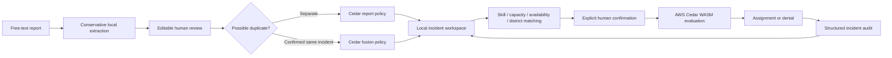

# Relay architecture

Relay is a local community flood-response rehearsal. All supplied incidents and teams are fictional. It does not contact emergency services.

## Implemented

- React and TypeScript with Vinext/Vite; Three.js priority field, projected interactive beacons, animated dispatch connections, geographic map fallback, reduced-motion behavior.
- Local language rules extract supported neighbourhoods, support cues, explicit headcounts and suggested priority. Missing or ambiguous facts remain blank for review. This is **not an AI model**, credibility classifier, diagnosis or factual verification.
- Duplicate suggestions compare vocabulary only within the same category and neighbourhood. Fusion is explicit, applies only to an open incident, preserves source text and original estimates, retains the higher reported headcount, and never adds duplicate headcounts together. Matching is recomputed afterward.
- AWS Cedar 4.13.0 runs as real WebAssembly. Policies check role, district, team availability, skills, capacity, incident state and human confirmation. Evaluation failures fail closed.
- A synchronous mutation lock prevents double submissions while Cedar evaluates. Zod validates persisted state and rejects duplicate IDs or simultaneous assignments of one team.
- Local activity feed, workspace-derived analytics, structured incident timelines and JSON export reflect actual local actions. This is not multi-device real-time synchronization.
- An isolated six-stage rehearsal uses real Cedar evaluations against seed data. Its internal state never calls workspace mutations or persistence. Play, pause, next and restart are available; closing cancels outstanding work.

## Persistence and limitations

State is stored in this browser's `localStorage` under `relay-workspace-v1`. It survives refresh on the same origin and device. Export before clearing browser data. Invalid stored snapshots are replaced in memory with the seed scenario. There is no server backup or authenticated login. Demo roles are intentionally switchable: browser Cedar evaluation is **not a production security boundary**.

The local workspace supports 500 signals, 30 supporting reports per incident and the latest 1,000 audit events. Earlier events without structured incident IDs are visible in the global decision log, but not retroactively inferred into timelines.

Geographic positions are neighbourhood centres. The Three.js field height encodes priority, **not elevation or flood depth**. Distances are straight-line Haversine distances; ETA assumes 18 km/h plus four minutes. Neither route nor ETA is road navigation or a verified arrival time.

Map tiles use OpenStreetMap; fonts use Google Fonts. Report text is not sent to either service. Core triage and Cedar do not require an API key.

## AWS cloud next step (not implemented or deployed)

For a production-oriented cloud version, authenticated identities would go through an API that obtains trusted team/incident attributes, calls Amazon Verified Permissions, and writes assignments with a transactional concurrency condition. Human confirmation would be tied to an authenticated request. Server-side audit and multi-client event delivery would follow that committed transaction. Model-assisted triage and S3 evidence uploads would need a separate data-handling and review workflow.

No AWS account is configured for this version. No Bedrock, Verified Permissions, S3, SNS or cloud deployment is claimed.
